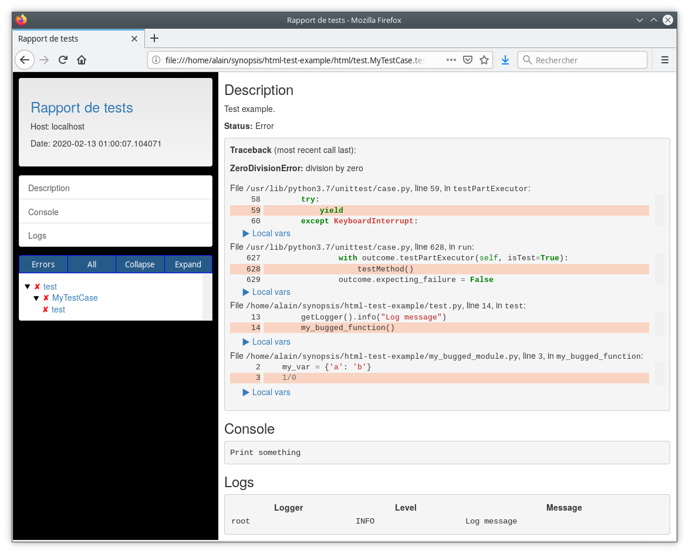

'Because testing should help, not constrain.'


## Example ##

* Source code: `my_bugged_module.py`

  ```python
   def my_bugged_function():
       my_var = {'a': 'b'}
       1/0
  ```

* Test case: `test.py`

  ```python
  from logging import getLogger
  from my_bugged_module import my_bugged_function
  from unittest import TestCase


  class MyTestCase(TestCase):

      def test(self):
          """
          Test example.
          """
          print("Print something")
          getLogger().info("Log message")
          my_bugged_function()
  ```

* Result:

  


### Use as nose plugin ###

```bash
nosetests --with-html-test test
```
